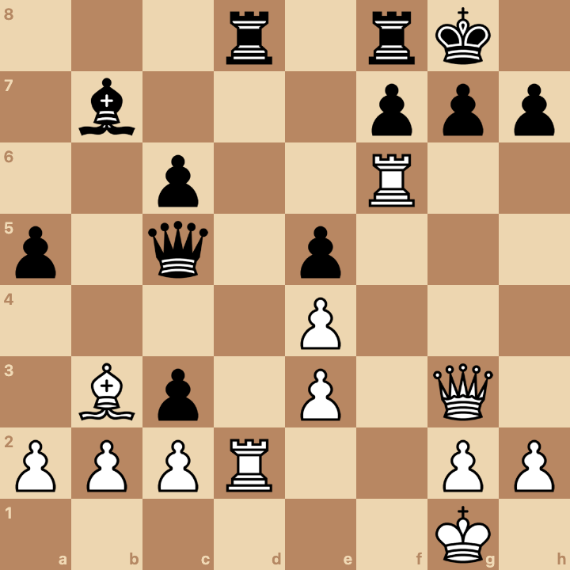
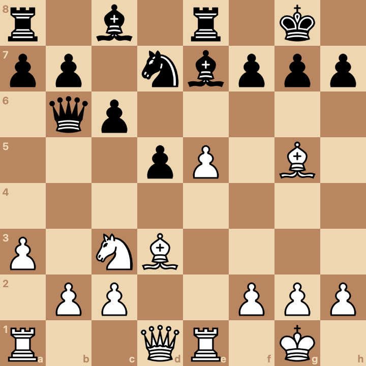
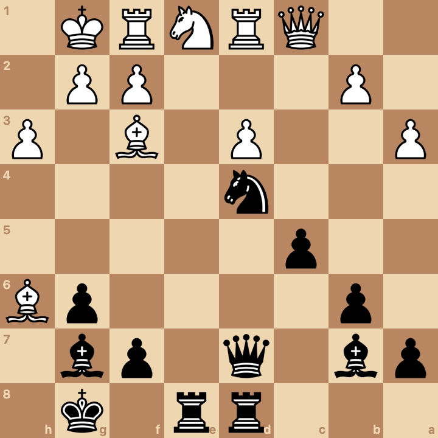
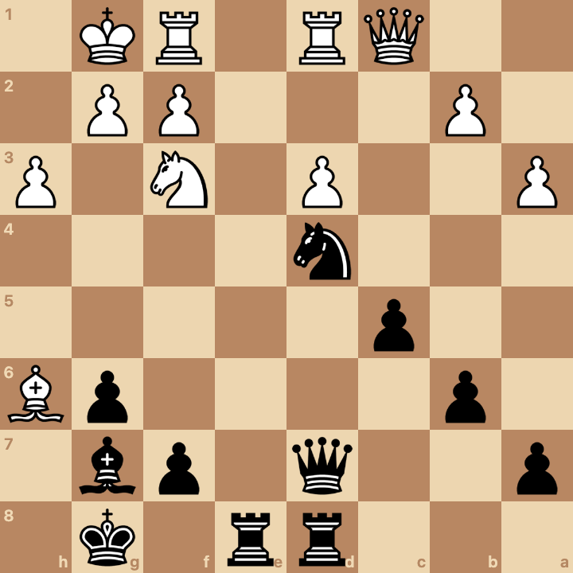
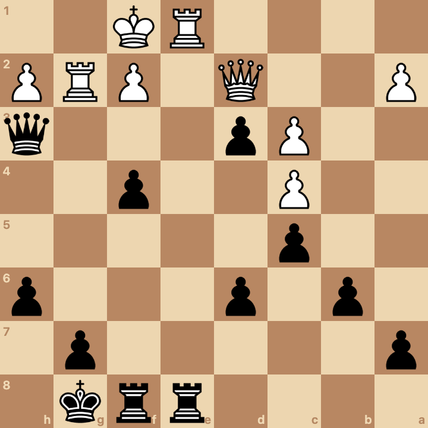
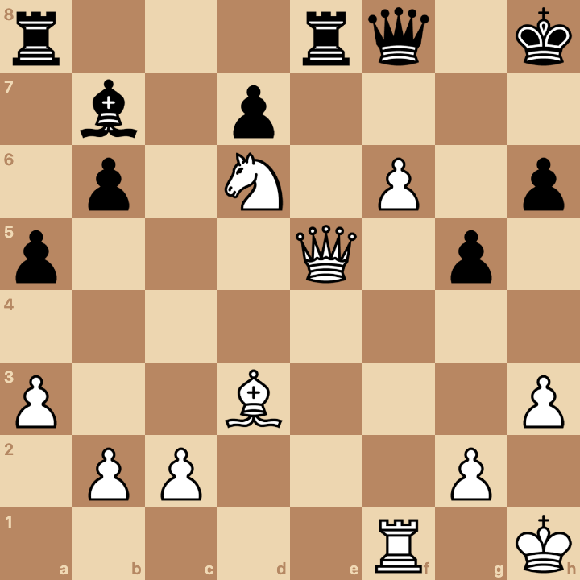
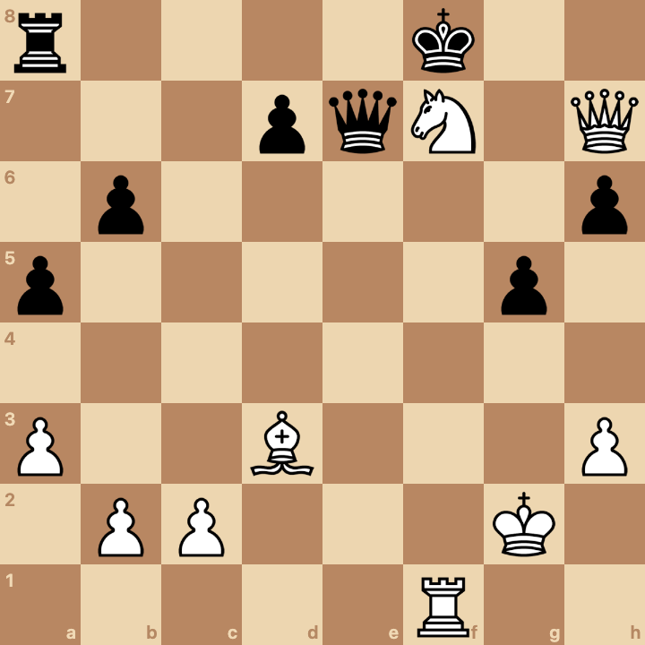
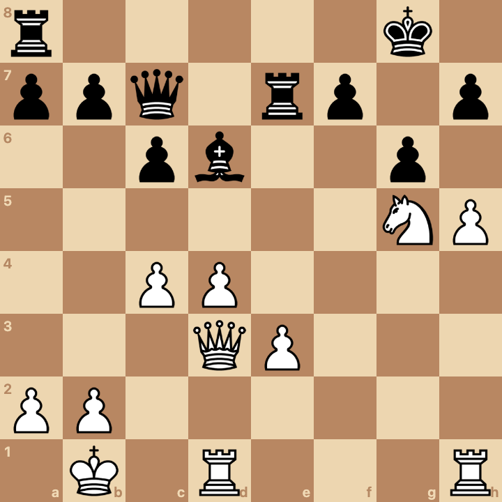
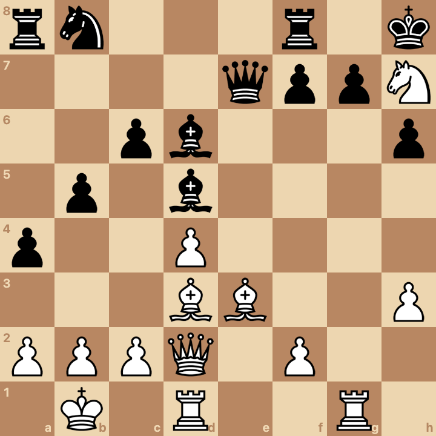

# puzzles

## Introduction

Puzzles are fun, and they're a great way to improve at chess.

In this readme I will present my reader with a series of puzzles.

Most of these puzzles, or all of these puzzles, are taken from my games.

I don't want to write a long introduction, so I think that we can start solving puzzles right away.

## Puzzles

Puzzle #1: Black to play and win  
Source: https://www.chess.com/game/live/141933455260?move=0

Puzzle #2: White to play and win  
Source: https://www.chess.com/game/live/141720564114?move=0

Puzzle #3: White to play and win  
Source: https://www.chess.com/game/live/141720564114?move=0

Puzzle #4: White to play and win  
Source: https://www.chess.com/game/live/130365619279?move=0

Puzzle #5: White to play and win  
Source: https://www.chess.com/game/live/130466457933?move=0

Puzzle #6: White to play and win  
Source: https://www.chess.com/game/live/130466457933?move=0

Puzzle #7: White to play and get an advantage  
Source: https://www.chess.com/game/live/131330416747?move=0

Puzzle #8: White to play and win  
Source: https://www.chess.com/game/live/131330416747?move=0

Puzzle #9: Black to play and win  
Source: https://www.chess.com/game/live/131509194521?move=0

Puzzle #10: White to play and get an advantage   
Source: https://www.chess.com/game/live/138705485870?move=0

Puzzle #11: White to play and get an advantage  
Source: https://www.chess.com/game/live/150019092343?move=0

Puzzle #12: White to play and win  
Source: https://www.chess.com/game/live/142221810828?move=0

Puzzle #13: White to play and win  
Source: https://www.chess.com/game/live/142462261936?move=0

Puzzle #14: White to play and win  
Source: https://www.chess.com/game/live/142462261936?move=0

Puzzle #15: White to play and win  
Source: https://www.chess.com/game/live/142462261936?move=0

Puzzle #16: White to play and win  
Source: https://www.chess.com/game/live/142462261936?move=0

Puzzle #17: White to play and get an advantage  
Source: https://www.chess.com/game/live/142489819442?move=0

Puzzle #18: White to play and get an advantage  
Source: https://www.chess.com/game/live/142489819442?move=0

Puzzle #19: White to play and win  
Source: https://www.chess.com/game/live/142489819442?move=0

Puzzle #20: White to play and win  
Source: https://www.chess.com/game/live/142489953106?move=0

Puzzle #21: White to play and win  
Source: https://www.chess.com/game/live/142489953106?move=0

Puzzle #22: White to play and win  
Source: https://www.chess.com/game/live/142489953106?move=0

Puzzle #23: White to play and win  
Source: https://www.chess.com/game/live/142489953106?move=0

Puzzle #24: White to play and win  
Source: https://www.chess.com/game/live/142489953106?move=0

Puzzle #25: White to play and win  
Source: https://www.chess.com/game/live/142489953106?move=0

Puzzle #26: White to play and win  
Source: https://www.chess.com/game/live/142489953106?move=0

Puzzle #27: White to play and win  
Source: https://www.chess.com/game/live/142660695546?move=0

Puzzle #28: White to play and win  
Source: https://www.chess.com/game/live/142660695546?move=0

Puzzle #29: White to play and win  
Source: https://www.chess.com/game/live/142660695546?move=0

Puzzle #30: White to play and win  
Source: https://www.chess.com/game/live/142660695546?move=0

Puzzle #31: White to play and win  
Source: https://www.chess.com/game/live/142660695546?move=0

Puzzle #32: White to play and win  
Source: https://www.chess.com/game/live/142660695546?move=0

Puzzle #33: White to play and win  
Source: https://www.chess.com/game/live/142660695546?move=0

Puzzle #34: White to play and win  
Source: https://www.chess.com/game/live/142662723816?move=0

Puzzle #35: White to play and win  
Source: https://www.chess.com/game/live/142662723816?move=0

Puzzle #36: White to play and win  
Source: https://www.chess.com/game/live/142662723816?move=0

Puzzle #37: Black to play and win  
Source: https://www.chess.com/game/live/142663129798?move=0

Puzzle #38: Black to play and win  
Source: https://www.chess.com/game/live/142663129798?move=0

Puzzle #39: Black to play and win  
Source: https://www.chess.com/game/live/142663129798?move=0

Puzzle #40: Black to play and win  
Source: https://www.chess.com/game/live/142663129798?move=0

Puzzle #41: Black to play and win  
Source: https://www.chess.com/game/live/142663129798?move=0

Puzzle #42: Black to play and win  
Source: https://www.chess.com/game/live/142663129798?move=0

Puzzle #43: Black to play and win  
Source: https://www.chess.com/game/live/142663129798?move=0

Puzzle #44: White to play and win  
Source: https://www.chess.com/game/live/142663213976?move=0

Puzzle #45: White to play and win  
Source: https://www.chess.com/game/live/142663213976?move=0

Puzzle #46: White to play and win  
Source: https://www.chess.com/game/live/142663213976?move=0

Puzzle #47: White to play and win  
Source: https://www.chess.com/game/live/142663213976?move=0

Puzzle #48: White to play and win  
Source: https://www.chess.com/game/live/142663213976?move=0

Puzzle #49: White to play and win  
Source: https://www.chess.com/game/live/142663213976?move=0

Puzzle #50: White to play and win  
Source: https://www.chess.com/game/live/142663213976?move=0

Puzzle #51: White to play and win  
Source: https://www.chess.com/game/live/142663213976?move=0

Puzzle #52: White to play and win  
Source: https://www.chess.com/game/live/142811634154?move=0

Puzzle #53: White to play and win  
Source: https://www.chess.com/game/live/142811634154?move=0

Puzzle #54: White to play and win  
Source: https://www.chess.com/game/live/142811634154?move=0

Puzzle #55: White to play and win  
Source: Taken from one of my games

Puzzle #56: White to play and win  
Source: Taken from one of my games

Puzzle #57: Black to play and win  
Source: Taken from one of my games

Puzzle #58: Black to play and win  
Source: Taken from one of my games

Puzzle #59: Black to play and win  
Source: Taken from one of my games

Puzzle #60: White to play and win  
Source: Taken from one of my games

Puzzle #61: Black to play and win  
Source: Taken from one of my games

Puzzle #62: Black to play and save the game  
Source: Taken from one of my games

Puzzle #63: White to play and win  
Source: Taken from one of my games

Puzzle #64: White to play and win  
Source: Taken from one of my games

Puzzle #65: White to play and win  
Source: Taken from one of my games

Puzzle #66: White to play and win  
Source: Taken from one of my games

Puzzle #67: White to play and win  
Source: Taken from one of my games

Puzzle #68: White to play and win  
Source: Taken from one of my games

Puzzle #69: White to play and win  
Source: Taken from one of my games

Puzzle #70: White to play and win  
Source: Taken from one of my games

Puzzle #71: White to play and win  
Source: Taken from one of my games

Puzzle #72: White to play and win  
Source: Taken from one of my games

Puzzle #73: White to play and win  
Source: Taken from one of my games

Puzzle #74: White to play and win  
Source: Taken from one of my games

## Solutions

Puzzle #1: Black to play and win  
Source: https://www.chess.com/game/live/141933455260?move=0

Solution: This is a beautiful puzzle! The move 17... Nf3+ is extremely tempting, because it forks the king and the queen, and after 18. gxf3 Bxf3 black's attack is overwhelming. The bishop on f3 can be supported by e4. If white plays Bd7, then the bishop runs out of squares after Rad8 Bf5 g6. When I played this move, I judged that the position after 18. gxf3 Bxf3 is winning for black. I saw that after 19. Qe3 e4 it is very difficult to stop checkmate. I actually missed Bd7, but it turns out that Bd7 doesn't work, because of Rad8 Bf5 g6. If you look at black's clock in the chess.com game, you'll see that I played this move in 13 seconds. I didn't calculate every line... but I was confident that black was winning after 18. gxf3 Bxf3 19. Qe3 e4. It turns out I played the best move. The move 17... Nf3+ is the best move and it wins the game for black.
