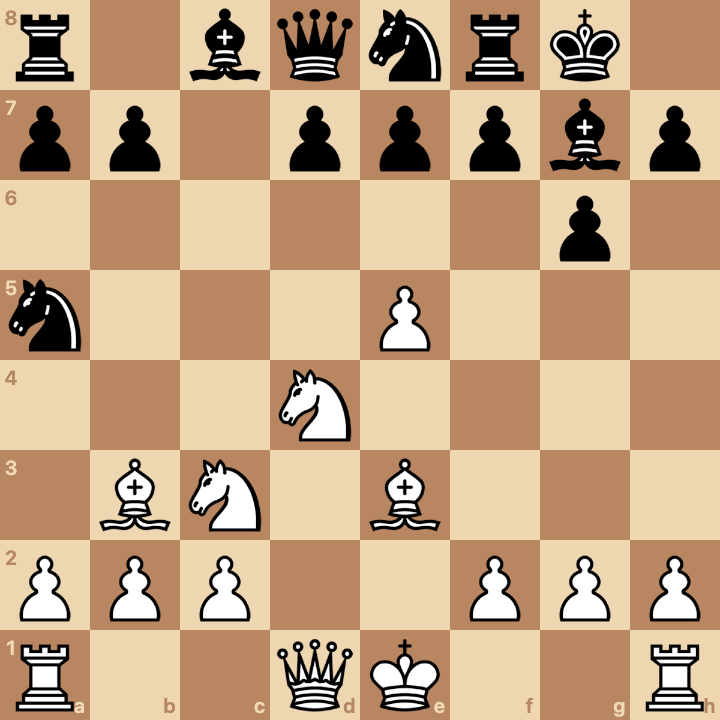
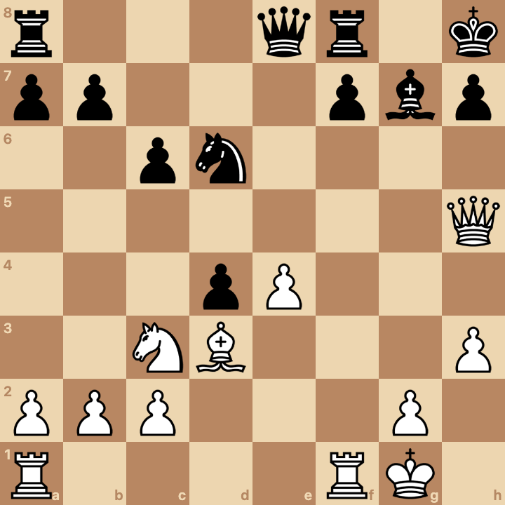

# Study #1

## Introduction

I like to say that positional chess means "learning chess by studying key positions".

The positions could be taken from the opening, the middlegame, or the endgame.

The positions could be tactical or strategic in nature.

In the puzzles below, we'll learn about chess history (like the games of Bobby Fischer) and we'll also learn how to evaluate a position and show that it's winning, losing, or drawing.

## Puzzles

Puzzle #1: [Fischer - Reshevsky 1958](https://www.chess.com/games/view/84629). White to move and win.

Puzzle #2: [Byrne - Fischer 1956](https://www.chess.com/games/view/75289). Black to move and win.

Puzzle #3: [Fischer - Benko 1963](https://www.chess.com/games/view/117108). White to move and win.

Puzzle #4: [Anon - ktm5124](https://www.chess.com/game/live/141933455260). Black to move and win.

## Solutions
