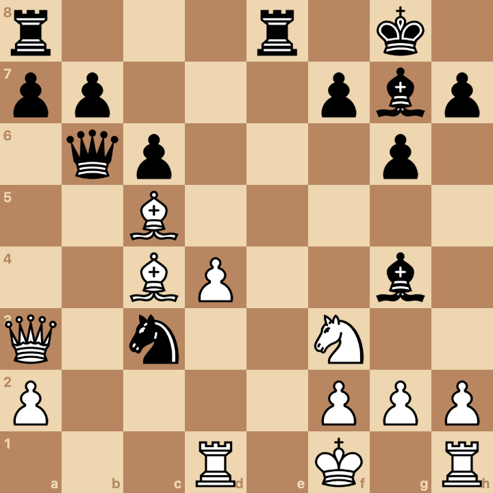
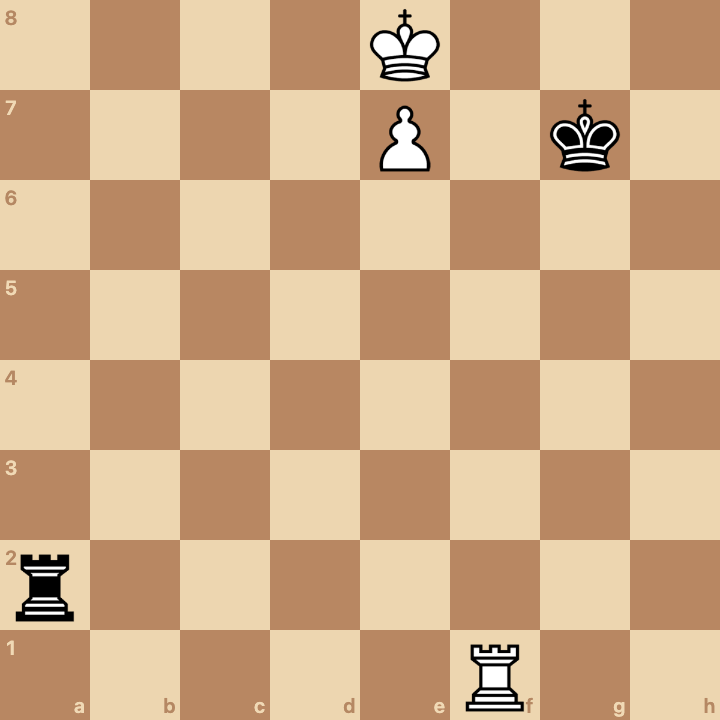
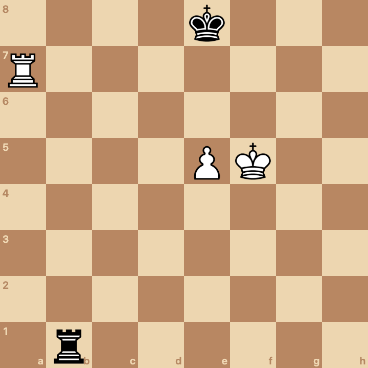
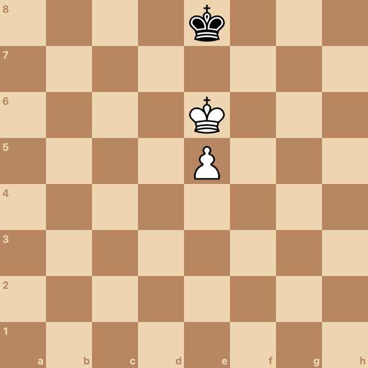
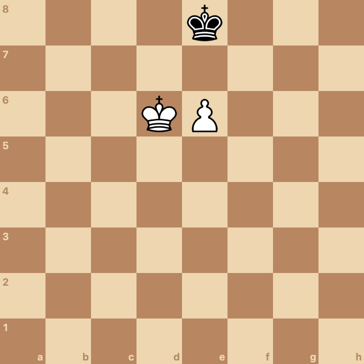
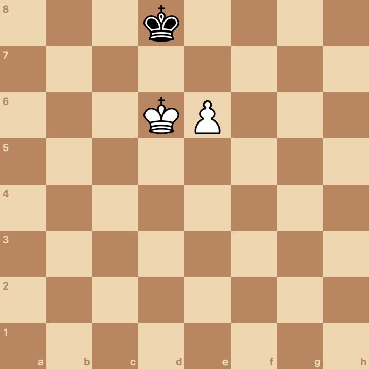
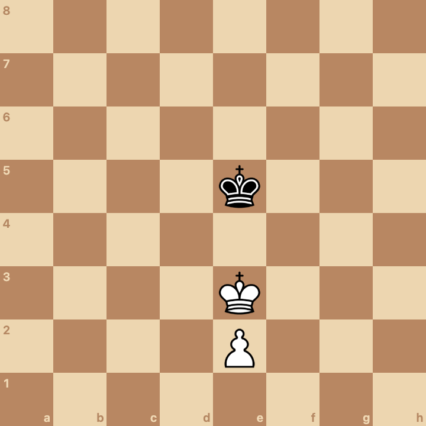
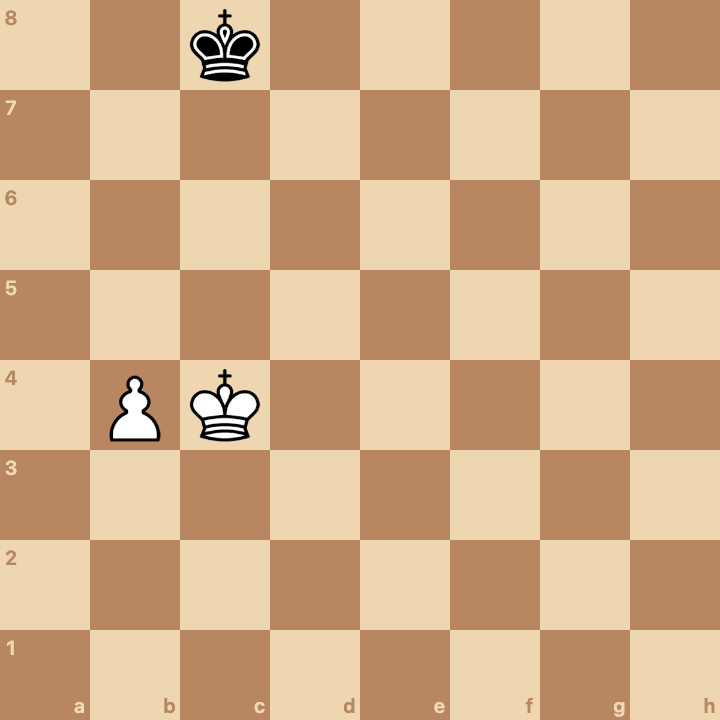
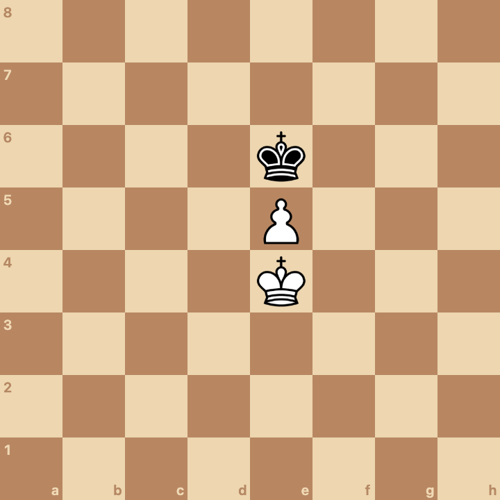

# Study #1

## Introduction

I like to say that positional chess means "learning chess by studying key positions". [\[1\]](#footnotes)

The positions could be taken from the opening, the middlegame, or the endgame.

The positions could be tactical or strategic in nature.

In the puzzles below, we'll learn about chess history (like the games of Bobby Fischer) and we'll also learn how to evaluate a position and show if it's winning, losing, drawing, balanced, or advantageous for one player.

## Puzzles

Puzzle #1: [Fischer - Reshevsky 1958](https://www.chess.com/games/view/84629). White to move and win.

Puzzle #2: [Byrne - Fischer 1956](https://www.chess.com/games/view/75289). Black to move and win.

Puzzle #3: [Fischer - Benko 1963](https://www.chess.com/games/view/117108). White to move and win.

Puzzle #4: [Anon - ktm5124 2025](https://www.chess.com/game/live/141933455260). Black to move and win.

Puzzle #5: The Lucena position. What is the evaluation if it is white's move? What if it's black's move?

Puzzle #6: The Philidor position. What is the evaluation if it is white's move? What if it's black's move?

Puzzle #7: Pawn on the 5th, king in front of pawn. What is the evaluation if it is white's move? What if it's black's move?

Puzzle #8: Pawn on the 6th, king beside the pawn. What is the evaluation if it is white's move? What if it's black's move?

Puzzle #9: Pawn on the 6th, king beside the pawn. What is the evaluation if it is white's move? What if it's black's move?

Puzzle #10: Pawn on the 2nd, king in front of pawn. What is the evaluation if it is white's move? What if it's black's move?

Puzzle #11: [Gligoric - Fischer 1959](https://www.chess.com/games/view/87355). Black to move. What is the evaluation?

Puzzle #12: Pawn on the 5th, king behind pawn. What is the evaluation if it is white's move? What if it's black's move?

## Solutions

## Footnotes

[1] I think there are many definitions of the phrase "positional chess". One definition, a very useful definition, is this: positional chess is evaluating positions. But we can also say that positional chess is synonymous with strategy. This is a second definition. A third definition that I like to use is this: positional chess is an approach to chess where the student learns chess by studying key positions.
